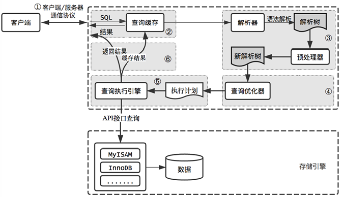

### 1 字段类型选取

#### 1.1 选取原则

**（1）尽量使用可以正确存储数据的最小数据类型**

​		  更小的数据类型占用更少的磁盘、内存和CPU缓存，处理时所需要的CPU周期更少

**（2）尽量使用简单数据类型**

​         处理时所需要的CPU周期更少

​         ① 使用MySQL时间类型（datetime、timestamp）而不是使用字符串来存储日期

​	     ② 使用整型而不是字符串来存储IP

**（3）尽量避免存储NULL值**

​          NULL是列的默认属性，最好指定列为NOT NULL，除非真的需要存储NULL值

#### 2 选取类型

**注：MySQL为了兼容性支持很多别名，下面类型只针对基本类型**

​        **MySQL的任何数据类型都可转换为Java的String类型**

##### 2.1 整型

**类型选取原则：正确存储数据的最小数据类型**

|         MySQL类型          | 存储二进制位数 |             范围             |    无符号范围    | 默认显示长度 |                  Java类型                   |
| :------------------------: | :------------: | :--------------------------: | :--------------: | :----------: | :-----------------------------------------: |
|  TINYINT[(M)]（UNSIGNED）  |       8        |          -128 ~ 127          |     0 ~ 255      |      4       |  TINYINT(1)：Boolean；TINYINT(>1)：Integer  |
| SMALLINT[(M)]（UNSIGNED）  |       16       |       -3,2768 ~ 3,2737       |    0 ~ 6,5535    |      6       |                   Integer                   |
| MEDIUMINT[(M)]（UNSIGNED） |       24       |     -838,8608 ~ 838,8607     |  0 ~ 1677,7215   |      9       |                   Integer                   |
|    INT[(M)]（UNSIGNED）    |       32       | -21,4748,3648 ~ 21,4748,3647 | 0 ~ 42,9496,7295 |      11      |     INT： Integer；INT UNSIGNED： Long      |
|  BIGINT[(M)]（UNSIGNED）   |       64       |     -2^(N-1) ~ 2^(N-1)-1     |    0 ~ 2^N-1     |      20      | BIGINT： Long；BIGINT UNSIGNED： BigInteger |

注：M表示显示长度，没有实际存储意义，一般省略(默认)。不过TINYINT对应的Java类型会有变化：

| TINYINT(1) | Boolean |
| :--------: | :-----: |
|     1      |  true   |
|     0      |  false  |

##### 2.2 实数类型

**选取原则：**

​	**（1）正确存储数据**

​	**（2）存储同样范围的值，DOUBLE和FLOAT比DECIMAL占用空间更少**

​	**（3）要对小数进行精确计算时，使用DECIMAL**

|    MySQL类型     |          存储字节数           |                         存储精度                          |  Java类型  |
| :--------------: | :---------------------------: | :-------------------------------------------------------: | :--------: |
|   FLOAT[(M,D)]   |              4 B              | 保留7位有效数字，其中1位为符号位，从高位开始四舍五入截取  |   Float    |
|  DOUBLE[(M,D)]   |              8 B              | 保留18位有效数字，其中1位为符号位，从高位开始四舍五入截取 |   Double   |
| DECIMAL[(M[,D])] | 每4 B存储9位数字，小数点占1 B |           M默认为10，D默认为0，最多存储65位数字           | BigDecimal |

注：

​	（1）FLOAT[(M,D)] [UNSIGNED]和DOUBLE[(M,D)]  [UNSIGNED]中M表示显示的总位数，D表示显示的小数位数，这种格式已在MySQL-8.0.17废除，此格式数据可通过命令行方式查看效果，DBeaver数据库可视化工具会自动进行数据截断。

​	（2）DECIMAL[(M[,D])]中M表示显示的总位数，D表示显示的小数位数；DECIMAL[(M[,D])] UNSIGNED已在MySQL-8.0.17废除。

##### 2.3 字符串类型

**选取原则：**

​        **CHAR：适合存储定长字符串，CHAR在存储空间上更有效率，同时也不容易产生碎片**

​		**VARCHAR：仅使用必要的空间，节省空间，提升性能，适合长度变化大的字符串**

| MySQL类型  |          存储字节数          | Java类型 |
| :--------: | :--------------------------: | :------: |
|  CHAR(M)   | 中文字符：3×M；英文字符：1×M |  String  |
| VARCHAR(M) | 中文字符：3×M；英文字符：1×M |  String  |

注：

​		CHAR(M)会自动删除字符串末尾空格，所存储的最大字节数为255 B。

​		VARCHAR(M)所存储的最大字节数为65535 B，其中所有列之间共享最大字节数。

##### 2.4 时间类型

**选取原则：**

​		**（1）正确存储数据**

​		**（2）DATETIME与TIMESTAMP区别：**

|   区别   |                 DATETIME                  |                 TIMESTAMP                 |
| :------: | :---------------------------------------: | :---------------------------------------: |
| 存储空间 |                    8 B                    |                    4 B                    |
| 表示范围 | 1000-01-01 00:00:00 ~ 9999-12-31 23:59:59 | 1970-01-01 00:00:00 ~ 2038-12-31 23:59:59 |
| 存取方式 |      插什么，存什么；存什么，取什么       |          根据时区存，根据时区取           |

注：TIMESTAMP[M]的M表示秒后面的小数位数，最大为6位，默认为0；如果插入小数位数超过指定长度，则进行四舍五入截断。

|   MySQL类型    |    说明     |                 表示范围                  |      Java类型      |
| :------------: | :---------: | :---------------------------------------: | :----------------: |
|      DATE      |    日期     |          -838:59:59 ~ 838:59:59           |   java.sql.Date    |
|      TIME      |    时间     |          1000-01-01 ~ 9999-12-31          |   java.sql.Time    |
|    DATETIME    | 日期 + 时间 | 1000-01-01 00:00:00 ~ 9999-12-31 23:59:59 | java.sql.Timestamp |
| TIMESTAMP([M]) | 日期 + 时间 | 1970-01-01 00:00:00 ~ 2038-12-31 23:59:59 | java.sql.Timestamp |

##### 2.5 文本类型

**选取原则：**

​		**（1）正确存储数据的最小数据类型**

​		**（2）与TEXT类型不同，BLOB类型可存储图片、表格**

| MySQL类型  | 存储容量（单位：字节） |       存储数据类型       | 字符集与排序规则 | Java类型 |
| :--------: | :--------------------: | :----------------------: | :--------------: | :------: |
|  TINYBLOB  |         255 B          | 二进制，可存储字符、图表 |        无        |  byte[]  |
|  TINYTEXT  |         255 B          |           字符           |        有        |  String  |
|    BLOB    |    65 KB = 66,560 B    | 二进制，可存储字符、图表 |        无        |  byte[]  |
|    TEXT    |    65 KB = 66,560 B    |           字符           |        有        |  String  |
| MEDIUMBLOB |  16 MB = 16,777,246 B  | 二进制，可存储字符、图表 |        无        |  byte[]  |
| MEDIUMTEXT |  16 MB = 16,777,246 B  |           字符           |        有        |  String  |
|  LONGBLOB  | 4 GB = 4,294,967,296 B | 二进制，可存储字符、图表 |        无        |  byte[]  |
|  LONGTEXT  | 4 GB = 4,294,967,296 B |           字符           |        有        |  String  |

##### 2.6 使用场景

（1）CHAR(M)存储密码的MD5值，CHAR(1)存储Y和N值表示开关状态

（2）使用无符号INT而不是VARCHAR(15)存储IPv4地址：INET_ATON(IPv4)  →  无符号整数；INET_NTOA(无符号整数)  →  IPv4

（3）使用UUID作为索引，转换为16字节数字保存在BINARY(16)：

​		  ① UNHEX(REPLACE(UUID(),'-',''))：CHAR  →  BINARY；HEX('BINARY')：BINARY  →  CHAR

​          ② UUID_TO_BIN(UUID())：CHAR  →  BINARY；BIN_TO_UUID('BINARY')：BINARY  →  CHAR

（4）存储财务数据，当数据量比较大时，可考虑使用BIGINT代替DECIMAL，操作数据时乘以或除以相同的倍数

### 二、高效索引应用

索引可用来做WHERE、ORDER BY、GROUP BY以及DISTINCT操作，主要有三个优势：

① 大大地减少了服务器需要扫描的数据量

② 可以帮助服务器避免排序和临时表

③ 可以将随机I/O变为顺序I/O

#### 1.1 索引类型

**（1）B+Tree索引**

InnoDB存储引擎使用的是B+Tree索引

联合索引（复合索引）：两个或多个字段组成的索引，格式如下

```mysql
key(field1, field2, field3)
```

B+Tree索引限制：遵循最左前缀原则

① 如果不是按照索引的最左列开始查找，则无法使用索引

② 不能跳过索引中的列

③ 如果查询中有某个列的范围查询，则右边所有列都无法使用索引优化查询

**（2）哈希索引**

Memory存储引擎默认使用的是哈希索引（hash index）

哈希索引基于哈希表实现，只有精确匹配索引所有列的查询才有效

**（3）空间数据索引**

MyISAM支持空间数据索引（R-Tree），可以用作地理数据存储

MySQL的GIS支持并不完善

**（4）全文索引**

全文索引查找的是文本中的关键词，而不是直接比较索引中的值

全文索引适用于MATCH AGAINST操作，而不是普通的WHERE条件操作

#### 1.2 使用索引

**（1）独立的列**

​		  索引列不能是表达式的一部分，也不能是函数的参数，索引应单速放在比较符号的左侧，要不然索引无法生效

**（2）前缀索引和索引选择型**

​		  索引开始的部分字符，节约索引空间

​          选择足够长的索引保证索引的选择性，也就是接近唯一性

​		  创建前缀索引：KEY(field(num))

​          前缀索引：

​				  优势：可使索引更小更快

​                  劣势：无法使用前缀索引进行ORDER BY和GROUP BY操作，也无法使用前缀索引做覆盖扫描（索引中列包含所有查询中要使用的列）

​         应用时字符串可翻转、组合以及截取成有一定顺序的字符串进行存储，提升索引效率

**（3）多列索引的列顺序**

当不需要考虑排序与分组时，将选择性最高的列放在索引最前列。

#### 1.3 索引实践

**（1）支持多种过滤条件**

查询只能使用索引的最左前缀，直到遇到第一个范围条件列，尽可能将需要做范围查询的列放到索引最末尾。

定义索引时，考虑表上所有用到的列；如果查询不限制某个列时，为了满足最左前缀原则，可通过IN()的方式覆盖那些不在WHERE子句中的列。

注意：IN()组合条件不能过多，每额外增加一个IN()条件，优化器需要做的组合将以指数形式增加，MySQL在组合数超过一定数量后就不在执行计划评估，这可能会导致MySQL不能很好地利用索引，最终可能会极大地降低查询性能。

**（2）避免多个范围条件**

根据索引最左前缀原则，只要第一次出现范围条件的列的索引生效，其后范围条件的列索引不生效。

可选方案：为不同的组合列创建不同的索引

代价：索引维护以及额外空间的占用

**（3）优化排序**

分页查询大量数据，性能优化：

① 限制用户能够翻页的数量

② 使用延迟关联，通过使用覆盖索引查询返回需要的主键，再根据这些主键关联原表获得需要的行

③ 反范式化、预先计算和缓存处理

**（4）选择和利用索引**

① 单行访问是很慢的，使用索引可以创建位置引用以提升效率

② 按顺序访问范围数据是很快的：第一，顺序I/O不需要多次磁盘寻道；第二，不在需要额外的排序操作

③ 索引覆盖查询是很快的，如果一个索引包含了查询需要的所有列，那么存储引擎就不再需要回表查找行

### 三、查询性能优化

#### 1 查询执行过程

##### 1.1 查询执行路径



（1）`客户端`发送一条查询给服务器

​		   注：MySQL客户端与服务端之间的通信协议是半双工的

```mysql
# 返回结果的command表示当前的查询状态
show full processlist;
```

（2）服务器先检查`查询缓存`，如果命中缓存，则立刻返回存储在缓存中的结果；否则进入下一阶段

​			注：MySQL 8.0 不在支持查询缓存（Query Cache）

（3）`解析器`先对SQL语句进行解析得到抽象语法树，然后使用`预处理器`判断抽象语法树中的表是否存在，如果表存在的话，再接着判断待查询字段是否存在

（4）抽象语法树通过`查询优化器`生成对应的执行计划

（5）MySQL根据优化器生成的执行计划，调用对应的`存储引擎API`来执行查询

（6）将结果返回到`客户端`，同时回填到`查询缓存`中

##### 1.2 SQL解析顺序

**SQL查询语句：**

```mysql
select distinct
	<select_list>
from
	<left_table> <join_type>
join
	<right_table>
on 
	<join_condition>
where
	<where_condition>
group by
	<group_by_list>
having
	<having_condition>
order by
	<order_by_condition>
limit
	<limit_condition>
```

**SQL执行顺序：**

```mysql
from
	<left_table>
on 
	<join_condition> <join_type>
join
	<right_table>
where
	<where_condition>
group by
	<group_by_list>
having
	<having_condition>
select distinct
	<select_list>
order by
	<order_by_condition>
limit
	<limit_condition>  
```

##### 1.3 优化数据访问

**优化数据的两个步骤：**

**（1）是否向数据库请求了不需要的数据**

① 查询不需要的记录：查询后面加上limit

② 多表关联时返回全部列：只取需要的列

③ 总是取出全部列：

​	         劣势：

​					第一，无法使用索引覆盖扫描（索引中已经包含了要查询的字段值，不需要再回表查询）

​                    第二，为服务器带来额外的I/O、内存和CPU的消耗

​             优势：

​					 简化开发，提高代码复用性

④ 重复查询相同的数据：初次查询缓存数据

**（2）MySQL是否在扫描额外的记录**

① 响应时间：服务时间（服务器处理查询时间）和排队时间（等待资源时间，比如：等待I/O操作、等待锁等）

② 扫描行数和返回行数：`扫描行数`应无限接近`返回行数`

优化方法：

​				第一，使用索引覆盖扫描

​				第二，改变库表结构，例如使用单独汇总表

​				第三，重构复杂查询：

​							a. 复杂查询与多个简单查询之间的取舍

​							b. 切分查询：分而治之，将大查询切分成小查询，每个查询功能一样，只完成一小部分，每次只返回一小部分查询结果

​										原因：如果使用大查询的话，则可能需要一次锁住很多数据、占满整个事务日志、耗尽系统资源、阻塞很多小的但重要的查询

​							c. 分解关联查询：

​										优势：缓存效率更高、减少锁的竞争、应用层关联更容易做到高性能和可扩展、提升效率、减少查询冗余记录

③ 扫描行数和返回类型（explain语句中type属性）：增加合适索引

MySQL使用三种方式应用WHERE条件，从好到坏依次为：

① 在索引中使用where条件过滤不匹配的记录（存储引擎层完成）

② 使用索引覆盖扫描（在Extra列中出现Using index），直接在索引中过滤不需要的记录并返回结果，无需回表查询（服务器层完成）

③ 从数据表中返回数据，然后过滤不满足条件的记录（在Extra列中出现Using where）(服务器层完成)

#### 2 操作语句优化

##### 2.1 优化count()查询

（1）count(*)：SQL92定义的标准统计行数，跟数据库无关，跟NULL与非NULL无关

（2）count(filed)：统计列值为非NULL的行数

（3）count(1)：

​		  对于InnoDB存储引擎，count(*)与count(1)操作，没有性能差异

​		  对于MyISAM存储引擎（存储表记录数），在没有WHERE条件下，使用count(*)直接返回存储行数；当第一列为NOT NULL时，count(1)进行同样的优化

##### 2.2 优化关联查询

（1）确保on或using子句的列上有索引

（2）确保group by和order by的表达式只涉及一个表的列

**（1） 登录MySQL服务器，输入密码**

```mysql
mysql -u root -p
```

**（2）查看数据库**

```mysql
show databases;
```

**（3）查看数据库表**

```mysql
# 切换到指定数据库
use 数据库名称;

# 查看数据库表
show tables;
```

**（4）查看表结构**

```mysql
describe tables;
```

**（5）操作表字段**

```mysql
# 增加字段
alter table 表名称 add 字段名称 double(10,4) null;

# 更新字段
alter table 表名称 change 旧字段名称 新字段名称 float(10,4) null;

# 删除字段
alter table 表名称 drop 字段名称;
```

**（6）操作表数据**

```mysql
# 创建表数据
insert into 表名称(字段名称1,字段名称2,字段名称3,字段名称4) values(值1,值2,值3,值4);

# 更新表数据
update 表名称 set 字段名称=值 where 字段名称=值;

# 查询表数据
select * from 表名称;

# 清除表数据
truncate table 表名称;
delete from 表名称;

# 时间函数:M表示秒后面的小数位数，最大为6位，默认为0
# 获取当前日期
curdate()
# 获取当前日期时间
current_timestamp([M])
now([M])
# 获取当前时间
curtime([M])
```

**（7）查看执行过程**

```mysql
# 查看查询行数
explain 查询语句;

# 查看profiling是否开启
show variables like '%pro%';

# 开启profiling
set profiling=1;

# 查看语句执行时间
show profiles;
```
